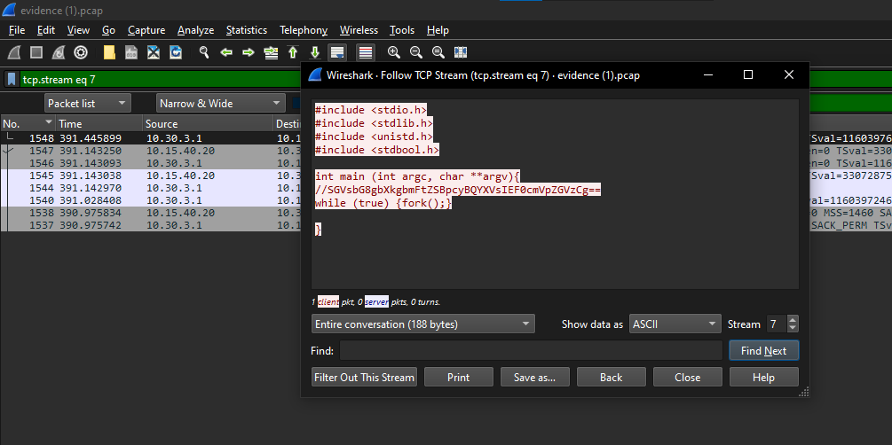

# Laporan Resmi Modul 1 Jaringan Komputer

Lapres Modul 1 Jaringan Komputer - **IT-03**

## Authors

| Nama                                                | NRP        |
| --------------------------------------------------- | ---------- |
| [Sighra Attariq Sumere Jati](https://www.github.com/sgraa) | 5027221068 |
| [Wilson Matthew Thendry](https://www.github.com/waifuwetdream) | 5027221024 |

## Hasil Pengerjaan

### ATM or ATP or FTP ? 🤔
Untuk mendapatkan flag dari case ini, kami diminta untuk menjawab password yang didapatkan hacker setelah bruteforce login ftp. Kami memanfaatkan filter `ftp` dan juga `tcp` dan kami mencari dimana terdapat respon login yang berhasil. Setelah menemukan paket yang dicari, kami mengikuti hingga stream `319` dan memperoleh *PASS m4y_th3_Kn!fe_ch1p_&_sh4tter*. Maka, password yang diperoleh hacker tersebut adalah **m4y_th3_Kn!fe_ch1p_&_sh4tter**

Berikut flag yang kami temukan dari menjawab pertanyaan yang diajukan.

### How many packets?
Dari case yang sebelumnya diminta untuk mencari tahu berapa banyak failed login attempt yang dilakukan attacker. Ketika terjadi login attempt yang gagal maka server akan memberikan response **"530 Login incorrect."** dengan frame length 94. Maka digunakan filter `frame.len==94 && ip.src==10.15.40.20` menampilkan semua paket yang dikirim dari server dengan frame length 94. Didapatkan jumlahnya ada 934 yang berarti attacker melakukan 934 kali percobaan login yang gagal.

### Evidence
Dalam case ini, terdapat beberapa langkah yang harus dilakukan serta beberapa case yang harus dijawab untuk memperoleh flag. Pertama, kita diminta untuk menganalisis terlebih dahulu file `.pcap` yang diberikan. Melalui file tersebut, diketahui bahwa kebanyakan packet yang dikirimkan dan diterima adalah dalam bentuk **HTTP**, kami juga mengetahui bahwa terdapat beberapa pola berulang dimana terjadi komunikasi **POST** dan **GET**. Kami memutuskan untuk menggunakan display filter `http.request.method == "POST"` dan mengamati bahwa terdapat berulang kali **POST** ke **/app/includes/process_login.php** dan menelusuri packet satu persatu. Kemudian kami menjawab pertanyaan yang diberikan yaitu domain korban, web server yang digunakan korban, endpoint untuk login sebagai user biasa, serta email dan password yang digunakan untuk login. Setelah menjawab pertanyaan dengan benar, ditemukanlah flag dari case ini.

Berikut flag yang kami temukan dari menjawab pertanyaan yang diajukan.

### Creds
Dalam case di case ini diminta untuk mencari kredensial yang digunakan attacker untuk login. Ketika terjadi login yang berhasil maka biasanya server akan memberikan response berupa "login success" atau semacamnya. Hal ini juga berarti bahwa paket yang dikirimkan ke server tepat sebelum paket response tersebut adalah password yang berasal dari attacker.

Selanjutnya digunakan filter `ip.src==10.30.1 && frame contains "USER"` untuk mendapat user yang digunakan oleh attacker.

Maka didapatkan kredesial attacker yaitu **USERNAME: h3ngk3rTzy** dan **PASSWORD: S!l3ncE**

### Malwleowleo
Dalam case yang sama dengan case sebelumnya diminta untuk menncari file malware yang diupload oleh attacker kedalam server, maka digunakan `frame contains "STOR" untuk mencari paket yang berisi upload ke server.`

### Secret
Terakhir diminta untuk mencari pesan rahasia dari attacker. Pesan tersebut tersimpan dalam gambar `mirza.jpg` yang berbunyi **Mio Mirza**

## Revisi dan Tambahan

### Fuzz
Dengan bentuk case yang mirip seperti **Evidence**, kami diminta untuk menjawab beberapa pertanyaan untuk memperoleh flag. Pertama, dilakukan analisis terhadap file `.pcap` yang telah diberikan dan ditemukan bahwa banyak packet dalam bentuk `http` serta `tcp`, kami memutuskan untuk mengikuti `http` dan menggunakan display capture `http.request.method == "POST"` dimana kami menemukan banyak packet yang mengirimkan **POST** dan kami memutuskan untuk mengikuti salah satu packet tersebut dan melakukan pencarian terhadap kode **302 Found** dan diperolehlah username beserta password dan juga tools yang digunakan hacker untuk bruteforce login.

Berikut merupakan flag yang berhasil kami peroleh.

### WhoAmI
Dalam case ini yang terhubung dengan case-case seperti *Creds* dan juga *Malwleowleo*, kami mengikuti stream yang sama dan berhasil menemukan sebuah pesan yang di-encode dalam format base64. Setelah di-decode, diperoleh pesan **Hello my name is Paul Atreides**. Kemudian nama Paul Atreides digunakan untuk menjawab pertanyaan yang diajukan dengan format **Paul_Atreides**.

Berikut hasil decoding dari pesan berformat base64 tersebut.

Hasil decoding pesan tersebut kemudian digunakan untuk memperoleh flag dibawah ini.
