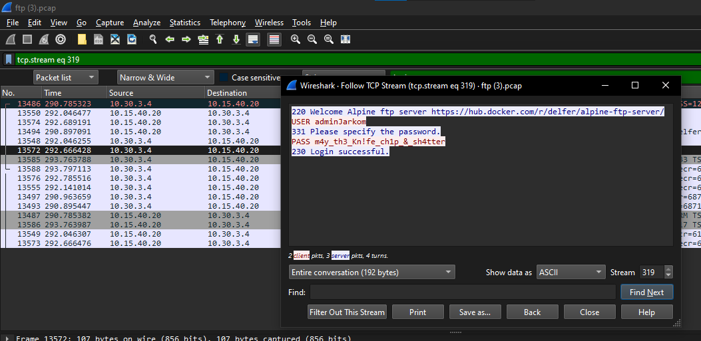

# Laporan Resmi Modul 1 Jaringan Komputer

Lapres Modul 1 Jaringan Komputer - **IT-03**

## Authors

| Nama                                                | NRP        |
| --------------------------------------------------- | ---------- |
| [Sighra Attariq Sumere Jati](https://www.github.com/sgraa) | 5027221068 |
| [Wilson Matthew Thendry](https://www.github.com/waifuwetdream) | 5027221024 |

## Hasil Pengerjaan

### ATM or ATP or FTP ? 🤔
Untuk mendapatkan flag dari soal ini, kami diminta untuk menjawab password yang didapatkan hacker setelah bruteforce login ftp. Kami memanfaatkan filter `ftp` dan juga `tcp` dan kami mencari dimana terdapat respon login yang berhasil. Setelah menemukan paket yang dicari, kami mengikuti hingga stream `319` dan memperoleh *PASS m4y_th3_Kn!fe_ch1p_&_sh4tter*. Maka, password yang diperoleh hacker tersebut adalah **m4y_th3_Kn!fe_ch1p_&_sh4tter**

Berikut flag yang kami temukan dari menjawab pertanyaan yang diajukan.

### Evidence
Dalam soal ini, terdapat beberapa langkah yang harus dilakukan serta beberapa soal yang harus dijawab untuk memperoleh flag. Pertama, kita diminta untuk menganalisis terlebih dahulu file `.pcap` yang diberikan. Melalui file tersebut, diketahui bahwa kebanyakan packet yang dikirimkan dan diterima adalah dalam bentuk **HTTP**, kami juga mengetahui bahwa terdapat beberapa pola berulang dimana terjadi komunikasi **POST** dan **GET**. Kami memutuskan untuk menggunakan display filter `http.request.method == "POST"` dan mengamati bahwa terdapat berulang kali **POST** ke **/app/includes/process_login.php** dan menelusuri packet satu persatu. Kemudian kami menjawab pertanyaan yang diberikan yaitu domain korban, web server yang digunakan korban, endpoint untuk login sebagai user biasa, serta email dan password yang digunakan untuk login. Setelah menjawab pertanyaan dengan benar, ditemukanlah flag dari soal ini.

Berikut flag yang kami temukan dari menjawab pertanyaan yang diajukan.

